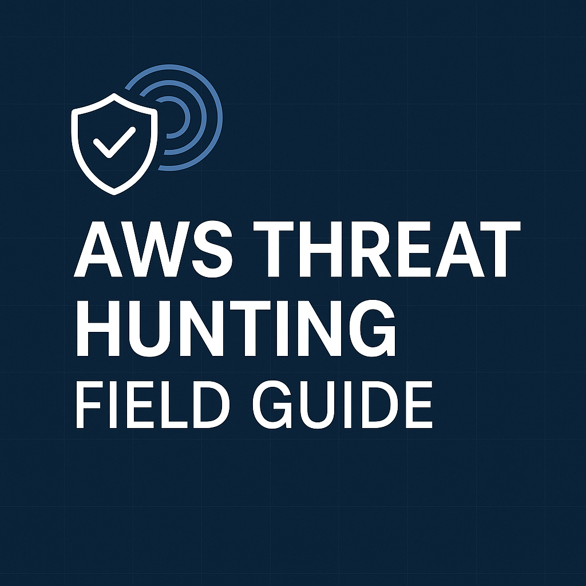

# AWS Threat Hunting — Field Guide

> Hunts-first AWS detection-engineering field guide with ES|QL queries, Sigma scaffolds, and AI prompt templates.  
> Coverage: IAM, S3, CloudTrail/Config/KMS, VPC/Network, EC2/EBS, Lambda, EKS, DNS, CloudFront/API, Secrets, GuardDuty correlations.  

**Quick Start**
1. Browse `detections/` for copy/paste queries.
2. Use `prompts/` to tune hunts for your schema.
3. Track readiness with `checklists/hunt-readiness.md`.

**Portable Artifacts**
- ES|QL: `esql/core/*`
- Sigma: `sigma/core/*`

See `detections/` for hunts, `prompts/` for LLM tuning, `sigma/` and `esql/` for portable artifacts.
